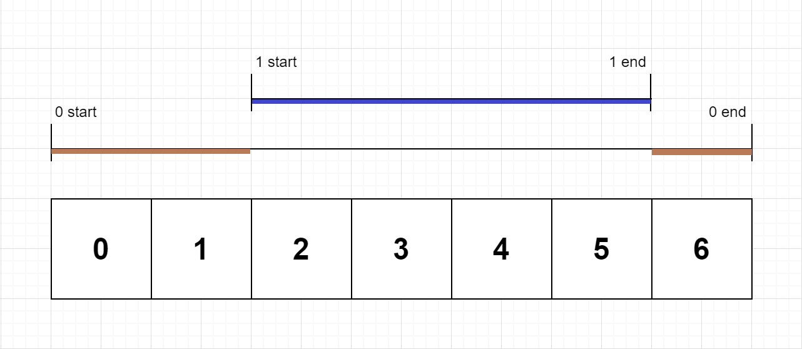

636. Exclusive Time of Functions

**Medium**

On a single threaded CPU, we execute some functions. Each function has a unique id between `0` and `N-1`.

We store logs in timestamp order that describe when a function is entered or exited.

Each log is a string with this format: `"{function_id}:{"start" | "end"}:{timestamp}"`. For example, `"0:start:3"` means the function with id `0` started at the beginning of timestamp `3`. `"1:end:2"` means the function with id `1` ended at the end of timestamp `2`.

A function's exclusive time is the number of units of time spent in this function. Note that this does not include any recursive calls to child functions.

The CPU is single threaded which means that only one function is being executed at a given time unit.

Return the exclusive time of each function, sorted by their function id.

Example 1:

```
Input:
n = 2
logs = ["0:start:0","1:start:2","1:end:5","0:end:6"]
Output: [3, 4]
```

Explanation:
Function 0 starts at the beginning of time 0, then it executes 2 units of time and reaches the end of time 1.
Now function 1 starts at the beginning of time 2, executes 4 units of time and ends at time 5.
Function 0 is running again at the beginning of time 6, and also ends at the end of time 6, thus executing for 1 unit of time.
So function 0 spends 2 + 1 = 3 units of total time executing, and function 1 spends 4 units of total time executing.



Note:

1. 1 <= n <= 100
2. Two functions won't start or end at the same time.
3. Functions will always log when they exit.

```js
/**
 * @param {number} n
 * @param {string[]} logs
 * @return {number[]}
 */
export const exclusiveTime = function(n, logs) {
  // 1. map string to array
  // 1.1 id -> number, type: str, time -> number, for end time, need to plus 1
  // 2. for loop the times and save to stack if it's start, and pop if it's end
  // 2.1 when stack is not empty, for the stack top, we need to save the time elapsed for it's id.
  // by using the current time in log to subtract the value in the stack top.

  const times = Array(n).fill(0);
  const mapper = log => {
    const [id, type, time] = log.split(':');
    return type === 'start' ? [Number(id), type, Number(time)] : [Number(id), type, Number(time) + 1];
  };
  const stack = [];

  for (let i = 0; i < logs.length; i++) {
    const cur = mapper(logs[i]);

    if (stack.length) {
      const pre = mapper(logs[i - 1]);
      const diff = cur[2] - pre[2];
      const id = stack[stack.length - 1][0];
      times[id] += diff;
    }

    if (cur[1] === 'start') {
      stack.push(cur);
    } else {
      stack.pop();
    }
  }

  return times;
};
```
